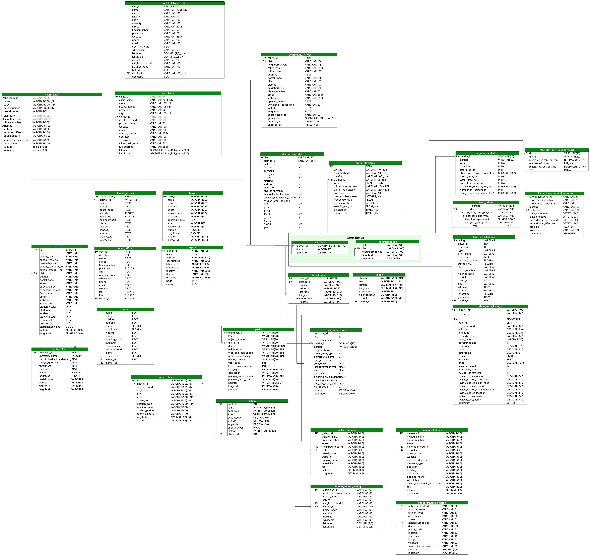

# Government Offices in Berlin - Data Transformation & Schema Design

## 📋 Project Overview

This project transforms raw OpenStreetMap (OSM) data of government and administrative offices in Berlin into a clean, structured dataset ready for database integration. The process includes data fetching, cleaning, geocoding, spatial enrichment, and schema design.

**Final Output:** 419 government offices with complete geographic and administrative information

---

## 🗂️ Project Structure

```
/scripts
  └── government_offices_data_transformation.ipynb
  └── README.md
/sources
  └── lor_ortsteile.geojson (Berlin districts/neighborhoods)
```

---

## 🔄 Data Pipeline

### 1. **Data Discovery & Fetching**
- **Source:** OpenStreetMap via OSMnx library
- **Query Tags:** `office=government`, `office=administrative`, `amenity=townhall`, `amenity=public_building`, `office=employment_agency`
- **Initial Result:** 441 entries with 177 columns
- **Filter:** Focused on German administrative offices (Bürgeramt, Finanzamt, etc.)

### 2. **Data Consolidation**
- **Column Merging:** Consolidated duplicate information across sparse OSM columns
  - `name` ← `name:de`, `name:en`, `official_name`
  - `opening_hours` ← `opening_hours:signed`
  - `website` ← `contact:website`
  - `phone_number` ← `contact:phone`, `phone`
  - `email` ← `contact:email`

### 3. **Standardization**
- **Column Mapping:** Renamed OSM columns to schema-aligned names (e.g., `addr:street` → `street`)
- **Structure:** Reduced from 177 to 16 core columns
- **Naming Convention:** snake_case format

### 4. **Geo-Enrichment**
- **Source:** Berlin LOR (Lebensweltlich Orientierte Räume) - `lor_ortsteile.geojson`
- **Process:** Spatial join to assign district/neighborhood to each office
- **Added Fields:**
  - `district` (12 Berlin districts)
  - `neighborhood` (97 neighborhoods)
  - `district_id` (8-digit official codes)
  - `neighborhood_id`
- **Data Quality:** Removed 21 offices outside boundaries or without names (441 → 420 rows)

### 5. **Coordinate Extraction**
- Extracted `latitude` and `longitude` from Point geometries
- Set `coordinate_type` to 'point'
- **Coverage:** 100% coordinate availability

### 6. **Address Construction**
- **Strategy 1:** Reverse geocoding via Nominatim API (100% success - 418 offices)
- **Strategy 2:** Fallback construction from components (74.5% success - 313 offices)
- **Final Coverage:** 100% (418/418 offices have complete addresses by strategy 1)
- **Format:** `"Street Housenumber, Postal_code City"`

### 7. **Geospatial Validation**
- **CRS:** Verified EPSG:4326 (WGS84)
- **Geometry Validation:** Fixed 1 multipart geometry 
- **Duplicate Removal:**
  - Exact duplicates by `office_id`
  - Near-duplicates (within 10m)
- **Final Status:** All 418 validated records

---

## 📊 Final Dataset

### Statistics
| Category | Completeness | Fields |
|----------|-------------|--------|
| **Excellent (100%)** | ✓ Complete | office_id, office_name, address, coordinates, district hierarchy, geometry |
| **Good (60-75%)** | ⚠️ Partial | postal_code, city, website |
| **Fair (30-50%)** | ⚠️ Sparse | phone_number, opening_hours, wheelchair_accessible |
| **Low (<30%)** | ❌ Limited | email |

### Data Quality Metrics
```
Total Records: 418
Validated Geometries: 418 (100%)
Complete Addresses: 418 (100%)
Geographic Assignment: 418 (100%)
Duplicate-Free: ✓ Yes
CRS Consistency: ✓ EPSG:4326
```

sqlCREATE TABLE government_offices_in_berlin (
    -- Primary Key
    office_id               BIGINT PRIMARY KEY NOT NULL,
    
    -- Foreign Keys
    district_id             VARCHAR(10) NOT NULL,
    neighborhood_id         VARCHAR(10) NOT NULL,
    
    -- Office Information
    office_name             VARCHAR(255) NOT NULL,
    office_type             VARCHAR(100),
    
    -- Location
    address                 TEXT NOT NULL,
    postal_code             VARCHAR(10),
    city                    VARCHAR(100),
    district                VARCHAR(100) NOT NULL,
    neighborhood            VARCHAR(100) NOT NULL,
    
    -- Contact Information
    phone_number            VARCHAR(50),
    email                   VARCHAR(255),
    website                 VARCHAR(500),
    
    -- Service Information
    opening_hours           TEXT,
    wheelchair_accessible   VARCHAR(20),
    
    -- Geospatial Data
    latitude                FLOAT NOT NULL,
    longitude               FLOAT NOT NULL,
    coordinate_type         VARCHAR(50) NOT NULL,
    geometry                GEOMETRY(Point, 4326) NOT NULL,
    
    -- Metadata
    created_at              TIMESTAMP DEFAULT CURRENT_TIMESTAMP,
    updated_at              TIMESTAMP DEFAULT CURRENT_TIMESTAMP
);

-- Indexes for optimal query performance
CREATE INDEX idx_district_id ON government_offices_in_berlin(district_id);
CREATE INDEX idx_neighborhood_id ON government_offices_in_berlin(neighborhood_id);
CREATE INDEX idx_office_type ON government_offices_in_berlin(office_type);
CREATE INDEX idx_postal_code ON government_offices_in_berlin(postal_code);
CREATE SPATIAL INDEX idx_geometry ON government_offices_in_berlin(geometry);
```

## 🛠️ Technologies Used

- **Python Libraries:**
  - `pandas` - Data manipulation
  - `geopandas` - Geospatial operations
  - `osmnx` - OpenStreetMap data fetching
  - `shapely` - Geometry handling
  - `geopy` - Reverse geocoding (Nominatim)

- **Data Sources:**
  - OpenStreetMap (OSM)
  - Berlin Open Data Portal (LOR boundaries)

---

### Column Reference

| Column | Type | Description | Completeness |
|--------|------|-------------|--------------|
| `office_id` | BIGINT | Unique OSM identifier (Primary Key) | 100% |
| `district_id` | VARCHAR(10) | 8-digit district code (Foreign Key) | 100% |
| `neighborhood_id` | VARCHAR(10) | Neighborhood identifier (Foreign Key) | 100% |
| `office_name` | VARCHAR(255) | Official office name | 100% |
| `office_type` | VARCHAR(100) | Office classification | 53.1% |
| `address` | TEXT | Complete formatted address | 100% |
| `postal_code` | VARCHAR(10) | 5-digit Berlin postal code | 73.2% |
| `city` | VARCHAR(100) | City name (Berlin) | 73.0% |
| `district` | VARCHAR(100) | District name | 100% |
| `neighborhood` | VARCHAR(100) | Neighborhood name | 100% |
| `phone_number` | VARCHAR(50) | Contact phone | 34.0% |
| `email` | VARCHAR(255) | Contact email | 16.0% |
| `website` | VARCHAR(500) | Official website URL | 62.0% |
| `opening_hours` | TEXT | Service hours | 39.5% |
| `wheelchair_accessible` | VARCHAR(20) | Accessibility information | 45.2% |
| `latitude` | FLOAT | WGS84 latitude | 100% |
| `longitude` | FLOAT | WGS84 longitude | 100% |
| `coordinate_type` | VARCHAR(50) | Geometry type (point) | 100% |
| `geometry` | GEOMETRY | PostGIS Point geometry | 100% |

---

## 🎯 Key Achievements

✅ Consolidated 441 raw OSM entries into 419 validated records  
✅ 89.5% address completion through dual-strategy geocoding  
✅ 100% geographic assignment (district/neighborhood)  
✅ Spatially validated geometries (EPSG:4326)  
✅ Production-ready database schema with indexes  
✅ Complete audit trail with timestamps  

---

## Schema



## 📝 License & Attribution

- **Data Source:** OpenStreetMap contributors (ODbL)
- **Administrative Boundaries:** Berlin Open Data Portal
- **Geocoding:** Nominatim (OpenStreetMap Foundation)

---

**Last Updated:** 11.11.2025  
