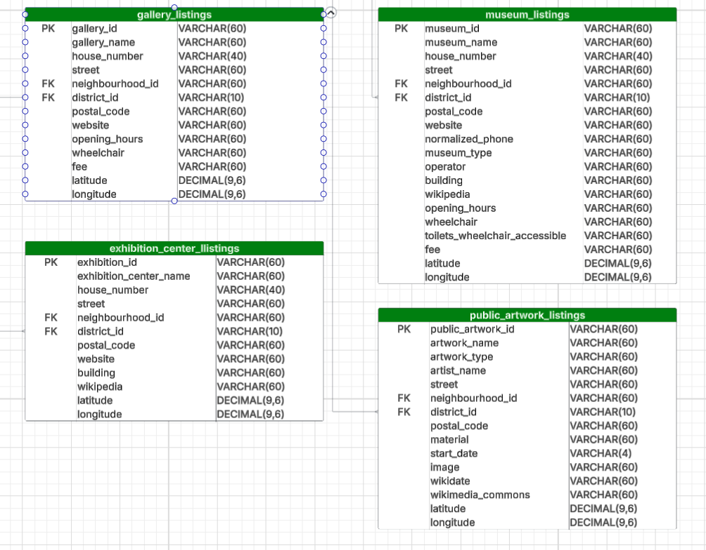

# 🏛️ Museums & Galleries in Berlin  
## 📌 Step 1: Research & Data Modelling

---

## 🔍 Data Source Discovery

- **Primary Source:** [OpenStreetMap (OSM)](https://www.openstreetmap.org) via the `osmnx` Python library  
  - **Why OSM?** Open, free, and continuously updated. Includes location, address, and metadata for museums, galleries, public artworks, and exhibition centers in Berlin.  
  - **Query Filters Used:**  
    - `tourism`: `["museum", "gallery", "artwork"]`  
    - `amenity`: `"exhibition_center"`  
  - **Data Type:** Dynamic (queried via API)  
  - **Update Frequency:** Continuous  

- **Additional Sources (not yet integrated):**  
  - [Berlin Open Data Portal](https://daten.berlin.de) – for optional enrichment  
  - [Deutsche Digitale Bibliothek REST API](https://www.deutsche-digitale-bibliothek.de/content/api) – requires API key  
  - [Kulturgutdigital – Berliner OpenGLAM-Daten](https://openglam.berlin.de) – cultural metadata

---

## 🗂️ Raw File Creation

- Generated separate raw files for each of the four tags (`museum`, `gallery`, `artwork`, `exhibition_center`)  
- Currently evaluating whether to merge into a single table or maintain separate datasets for artworks and exhibition centers  
- Identifying common columns for potential joins

---

## ✅ To Do

### 🔧 Column Selection
- Plan to remove columns with **≥ 75% missing data**

### 🧭 Schema Planning
- Add `latitude` and `longitude` to the cleaned dataset

### 🔄 Transformation Strategy
- Rename columns for consistency across layers  
- Align naming conventions with the ERD (Entity Relationship Diagram)

---

## 🛠️ Tools & Technologies

- **Languages & Libraries:**  
  - Python  
  - `osmnx`, `geopandas`, `pandas`  
- **Environment:**  
  - Jupyter Notebook (for analysis and exploration)

---

## 📌 Step 2: Data Transformation & Preprocessing

After a thorough examination of the raw data, I decided to maintain four distinct tables — one for each cultural layer — to preserve schema clarity and support tailored enrichment workflows. This modular approach allows for future merging if needed, while respecting the unique tagging schemes of each category.

The following layers are processed independently:

- 🖼️ **Galleries**
- 🏛️ **Museums**
- 🎨 **Public Artworks**
- 🏢 **Exhibition Centers**

Each layer will be transformed in its own notebook and pushed to the database as a separate table.

---

## 🖼️ Galleries — Data Transformation & Preprocessing

📓 Notebook: `galleries_data_transformation.ipynb`

### ✅ Initial Setup
- Imported all required libraries
- Loaded raw gallery data

### 🧹 Column Cleanup
- Dropped unnecessary columns:
  - `Berlin` and `DE` — redundant since the dataset is Berlin-specific
  - `tourism` — all entries are galleries
  - `suburb` — duplicate of `neighbourhood`, which is enriched later
- Standardized column names:
  - Removed whitespace and special characters
  - Replaced spaces with underscores
  - Converted all names to lowercase
  - Removed `addr:` prefixes
  - Renamed column names for clarity

### 🔍 Data Enrichment
- Fetched `district_name` and `neighbourhood_id` from `or_ortsteile.geojson`
- Added `district_id` for foreign key reference
- Used reverse geocoding to retrieve:
  - `street` and `postal_code`
  - Filled missing values in original columns where applicable

### 🧼 Data Cleaning
- Replaced all missing values with `NaN`
- Normalized Street names
- Converted all text fields to lowercase to prevent duplication due to case differences
- Dropped temporary columns: `geometry`, `districts`, `postal_code_from_geo`, `street_from_geo`
- Verified and corrected data types
- Removed duplicate rows
- Removed row if the gallery name is missing
- Reordered columns to match the ERD schema
- Replaced yes/no with True/False in the fee column

- Save gallery_listings.csv to source folder
- Final Summary and check of data

---

### 🧾 Planned Schema: `gallery_listings`

| Column Name        | Data Type | Description             | Example             |
|--------------------|-----------|-------------------------|---------------------|
| gallery_id         | text      | Unique gallery ID       | 301107444           |
| gallery_name       | text      | Name of the gallery     | atelier achim kühn  |
| house_number       | text      | House number            | 12A                 |
| street             | text      | Street name             | invalidenstraße     |
| neighbourhood_id   | text      | FK to neighbourhood     | 0908                |
| district_id        | text      | FK to district          | 11009009            |
| postal_code        | text      | Postal code             | 10115               |
| website            | text      | Gallery website         | www.example.com     |
| opening_hours      | text      | Opening times           | Mo-Su 10:00-18:00   |
| wheelchair         | text      | Wheelchair accesible    | yes /no /limited    |
| fee                | text      | Entry fee info          | True/False          |
| latitude           | float     | Latitude coordinate     | 52.5200             |
| longitude          | float     | Longitude coordinate    | 13.4050             |

---

## 🏛️Museums — Data Transformation & Preprocessing

📓 Notebook: `museums_data_transformation.ipynb`

### ✅ Initial Setup
- Imported all required libraries
- Loaded raw museum data

### 🧹 Column Cleanup
- Dropped unnecessary columns:
  - `Berlin` and `DE` — redundant since the dataset is Berlin-specific
  - `tourism` — all entries are galleries
  - `suburb` — duplicate of `neighbourhood`, which is enriched later
- Standardized column names:
  - Removed whitespace and special characters
  - Replaced spaces with underscores
  - Converted all names to lowercase
  - Removed `addr:` prefixes
- Rename columns for clarity

### 🔍 Data Enrichment
- Fetched `district_name` and `neighbourhood_id` from `or_ortsteile.geojson`
- Added `district_id` for foreign key reference
- Used reverse geocoding to retrieve:
  - `street` and `postal_code`
  - Filled missing values in original columns where applicable

### 🧼 Data Cleaning
- Replaced all missing values with `NaN`
- Replace yes/no with True/False in the fee column
- Checked if website Nan and replaced with contact_website data id available
- Normalized the street names
- Normalized the phone numbers
- Converted all text fields to lowercase to prevent duplication due to case differences
- Dropped temporary columns: `geometry`, `districts`, `postal_code_from_geo`, `street_from_geo`, `wikidata`, `fee_icon_member`, `contact_website`
- Verified and corrected data types
- Removed duplicate rows
- Remove row if museum_name missing
- Reordered columns to match the ERD schema

- Save museum_listings.csv to source folder
- Final Summary and check of data

---

### 🧾 Planned Schema: `gallery_listings`

| Column Name        | Data Type | Description             | Example             |
|--------------------|-----------|-------------------------|---------------------|
| museum_id          | text      | Unique museum ID        | 301107444           |
| museum_name        | text      | Name of the museum      | atelier achim kühn  |
| house_number       | text      | House number            | 12A                 |
| street             | text      | Street name             | invalidenstraße     |
| neighbourhood_id   | text      | FK to neighbourhood     | 0908                |
| district_id        | text      | FK to district          | 11009009            |
| postal_code        | text      | Postal code             | 10115               |
| website            | text      | Museum website          | www.example.com     |
| normalized_phone   | text      | Museum contact          | 11009009            |
| museum_type        | text      | Type of museum          | Railway / Maritime  |
| operator           | text      | In charge of museum     | astak e.v.          |
| building           | text      | Type of building        | Church / Appartment |
| wikipedia          | text      | Wiki Info               | de:stiftung flucht  |
| opening_hours      | text      | Opening times           | Mo-Su 10:00-18:00   |
| fee                | text      | Entry fee info          | True/False          |
| wheelchair         | text      | Wheelchair accesible    | yes /no /limited    |
| toilets_wheelchair | text      | Toilet Wheelchair acces | yes /no /limited    |
| latitude           | float     | Latitude coordinate     | 52.5200             |
| longitude          | float     | Longitude coordinate    | 13.4050             |

---

## 🏢 Exhibition Centers — Data Transformation & Preprocessing
📓 Notebook: `exhibition_centers_data_transformation.ipynb`

### ✅ Initial Setup
- Imported all required libraries
- Loaded raw gallery data

### 🧹 Column Cleanup
- Dropped unnecessary columns:
  - `Berlin` and `DE` — redundant since the dataset is Berlin-specific
  - `tourism` — all entries are galleries
  - `suburb` — duplicate of `neighbourhood`, which is enriched later
- Standardized column names:
  - Removed whitespace and special characters
  - Replaced spaces with underscores
  - Converted all names to lowercase
  - Removed `addr:` prefixes
- Renamed columns for clarity

### 🔍 Data Enrichment
- Fetched `district_name` and `neighbourhood_id` from `or_ortsteile.geojson`
- Added `district_id` for foreign key reference
- Used reverse geocoding to retrieve:
  - `street` and `postal_code`
  - Filled missing values in original columns where applicable

### 🧼 Data Cleaning
- Replaced all missing values with `NaN`
- Converted all text fields to lowercase to prevent duplication due to case differences
- Normalized the street names
- Dropped temporary columns: `geometry`, `districts`, `postal_code_from_geo`, `street_from_geo`
- Verified and corrected data types
- Removed duplicate rows
- Reordered columns to match the ERD schema

- Save exhibition_center_listings.csv to source folder
- Final Summary and check of data

---

### 🧾 Planned Schema: `gallery_listings`

| Column Name           | Data Type | Description             | Example             |
|-----------------------|-----------|-------------------------|---------------------|
| exhibition_id         | text      | Unique exhibition ID    | 301107444           |
| exhibition_center_name| text      | Name of the exhibition  | Messe Berlin        |
| house_number          | text      | House number            | 12A                 |
| street                | text      | Street name             | invalidenstraße     |
| neighbourhood_id      | text      | FK to neighbourhood     | 0908                |
| district_id           | text      | FK to district          | 11009009            |
| postal_code           | text      | Postal code             | 10115               |
| website               | text      | Exhibition website      | www.example.com     |
| building              | text      | Indoor our Outdo        | yes / no            |
| wheelcwikipedi        | text      | Wiki details            | de:Messegelände     |
| latitude              | float     | Latitude coordinate     | 52.5200             |
| longitude             | float     | Longitude coordinate    | 13.4050             |

---

## 🎨 Public Artworks — Data Transformation & Preprocessing

📓 Notebook: `public_artworks_data_transformation.ipynb`

### ✅ Initial Setup
- Imported all required libraries
- Loaded raw gallery data

### 🧹 Column Cleanup
- Dropped unnecessary columns:
  - `Berlin` and `DE` — redundant since the dataset is Berlin-specific
  - `tourism` — all entries are galleries
  - `suburb` — duplicate of `neighbourhood`, which is enriched later
- Standardized column names:
  - Removed whitespace and special characters
  - Replaced spaces with underscores
  - Converted all names to lowercase
  - Removed `addr:` prefixes
  - Renamed artwork_name for clarity

### 🔍 Data Enrichment
- Fetched `district_name` and `neighbourhood_id` from `or_ortsteile.geojson`
- Added `district_id` for foreign key reference
- Used reverse geocoding to retrieve(created new columns as none in original raw data):
  - `street`,`postal_code` and `house_number`

### 🧼 Data Cleaning
- Replaced all missing values with `NaN`
- Normalized the street name
- Converted all text fields to lowercase to prevent duplication due to case differences
- Dropped temporary columns: `geometry`, `districts`
- Verified and corrected data types
- Removed duplicate rows
- Remove the row if the artwork_name is missing
- Reordered columns to match the ERD schema

- Save public_artwork_listings.csv to source folder
- Final Summary and check of data

---

### 🧾 Planned Schema: `public_artworks_listings`

| Column Name        | Data Type | Description             | Example             |
|--------------------|-----------|-------------------------|---------------------|
| public_artwork_id  | text      | Unique artwork ID       | 301107444           |
| artwork_name       | text      | Name of the artwork     | Seepferdchen        |
| artwork_type       | text      | Type of artwork         | sculpture           |
| artist_name        | text      | Name of the artist      | Jo Doese            |
| house_number       | text      | House number            | 12A                 |
| street             | text      | Street name             | invalidenstraße     |
| neighbourhood_id   | text      | FK to neighbourhood     | 0908                |
| district_id        | text      | FK to district          | 11009009            |
| postal_code        | text      | Postal code             | 10115               |
| material           | text      | Artwork material        | steel               |
| start_date         | text      | Start of artwork        | 2023                |
| image              | text      | image link              | https://photos.app. |
| wikidata           | text      | wikidata code           | Q881611             |
| wikimedia_commons  | text      | wikimedia link          | Category:Begegnung  |
| latitude           | float     | Latitude coordinate     | 52.5200             |
| longitude          | float     | Longitude coordinate    | 13.4050             |

---

# ✅ Step 3: Database Population

The following process was applied to **all four tables**:

- 🖼️ **Galleries**
- 🏛️ **Museums**
- 🎨 **Public Artworks**
- 🏢 **Exhibition Centers**

---

## **Process Overview**

### 1. Upload the Table to AWS RDS
- **Imported Libraries**
  - `psycopg2`
  - `create_engine` and `text` from `sqlalchemy`
  - `warnings` (filtered with `'ignore'`)

### 2. Load Credentials
- Retrieved AWS RDS credentials for connection.

### 3. Create Connection
- Connected to **PostgreSQL**:
  - Database: `layereddb`
  - Schema: `berlin_source_data`

### 4. Create Table
- Used `create_table_query` to define:
  - **Column names**
  - **Constraints**
  - **Data types**

#### **Constraints Added**
- `id` as **Primary Key** and **Unique**
- `district_id` as **Foreign Key**:
    ```sql
    CONSTRAINT district_id_fk FOREIGN KEY (district_id)
        REFERENCES berlin_data.districts(district_id)
        ON DELETE RESTRICT
        ON UPDATE CASCADE
    ```
    - **ON DELETE RESTRICT** → prevents deletion of `district_id` if still linked
    - **ON UPDATE CASCADE** → updates child table automatically if parent changes
- **NOT NULL** columns:
    - `id`
    - `name`
    - `district_id`
    - `latitude`
    - `longitude`

### 5. Execute Table Creation
- Ran `create_table_query` to create the table.

### 6. Append Data
- Used `.to_sql()` to append rows to the table.

### 7. Validate
- Executed a **SQL query** on the new table to confirm data was successfully inserted.

---

✅ This process ensures proper relational integrity and data consistency across all tables.

## Final ERD



