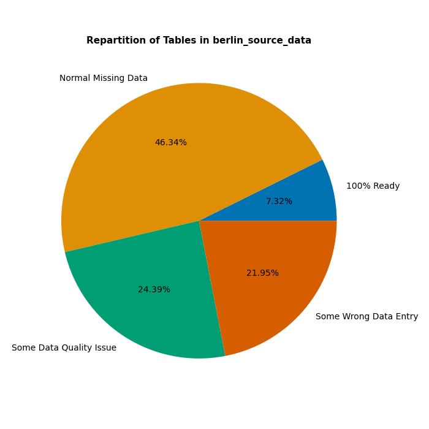

# Data Quality Audit Report

### Schema 'berlin_source_data' Overview

### Table / Column

| Table Name | Column | % Missing | Potential Issue | Note |
| :--- | :--- | :---: | :--- | :--- |
| long_term_listings | number_of_rooms | 18.42% | Need to be converted in NaN | Wrong Data Entry |
| long_term_listings | floor | 53.98% | Data Quality Issue | Unexpected 0s and/or '0's |
| public_artworks | artist_name | 25.68% | Need to be converted in NaN | Wrong Data Entry |
| public_artworks | start_date | 52.03% | Need to be converted in NaN | Wrong Data Entry |
| kindergartens | name | 3.23% | Need to be converted in NaN | Wrong Data Entry |
| hospitals | name | 2.39% | Need to be converted in NaN | Wrong Data Entry |
| hospitals | operator | 66.14% | Need to be converted in NaN | Wrong Data Entry |
| hospitals | country | 29.08% | Need to be converted in NaN | Wrong Data Entry |
| hospitals | city | 30.28% | Need to be converted in NaN | Wrong Data Entry |
| hospitals | street | 23.51% | Need to be converted in NaN | Wrong Data Entry |
| hospitals | housenumber | 24.7% | Need to be converted in NaN | Wrong Data Entry |
| hospitals | postcode | 27.89% | Need to be converted in NaN | Wrong Data Entry |
| hospitals | phone | 77.29% | Need to be converted in NaN | Wrong Data Entry |
| hospitals | email | 93.23% | Need to be converted in NaN | Wrong Data Entry |
| hospitals | website | 59.76% | Need to be converted in NaN | Wrong Data Entry |
| hospitals | emergency | 84.06% | Need to be converted in NaN | Wrong Data Entry |
| hospitals | speciality | 64.54% | Need to be converted in NaN | Wrong Data Entry |
| hospitals | opening_hours | 72.91% | Need to be converted in NaN | Wrong Data Entry |
| recycling_points | name | 0.07% | Need to be converted in NaN | Wrong Data Entry |
| recycling_points | access_restriction | 93.14% | Need to be converted in NaN | Wrong Data Entry |
| recycling_points | is_operational | 99.96% | Need to be converted in NaN | Wrong Data Entry |
| recycling_points | floor_level | 100.0% | Data Quality Issue | Unexpected 0s and/or '0's |
| pools | open_all_year | 100.0% | Data Quality Issue | Unexpected 0s and/or '0's |
| social_clubs_activities | housenumber | 34.02% | Data Quality Issue | Unexpected 0s and/or '0's |
| social_clubs_activities | opening_hours | 77.74% | Need to be converted in NaN | Wrong Data Entry |
| social_clubs_activities | wheelchair | 80.04% | Need to be converted in NaN | Wrong Data Entry |
| short_term_listings | name | 0.01% | Data Quality Issue | Unexpected 0s and/or '0's |
| short_term_listings | accommodates | 9.49% | Need to be converted in NaN | Wrong Data Entry |
| short_term_listings | bedrooms | 75.19% | Data Quality Issue | Unexpected 0s and/or '0's |
| short_term_listings | beds | 68.09% | Data Quality Issue | Unexpected 0s and/or '0's |
| short_term_listings | bathrooms | 83.63% | Data Quality Issue | Unexpected 0s and/or '0's |
| short_term_listings | is_shared | 100.0% | Data Quality Issue | Unexpected 0s and/or '0's |
| short_term_listings | minimum_nights | 18.7% | Need to be converted in NaN | Wrong Data Entry |
| short_term_listings | maximum_nights | 0.11% | Need to be converted in NaN | Wrong Data Entry |
| short_term_listings | number_of_reviews | 31.05% | Data Quality Issue | Unexpected 0s and/or '0's |
| short_term_listings | review_scores_rating | 23.77% | Data Quality Issue | Unexpected 0s and/or '0's |
| short_term_listings | review_scores_accuracy | 23.8% | Data Quality Issue | Unexpected 0s and/or '0's |
| short_term_listings | review_scores_cleanliness | 23.73% | Data Quality Issue | Unexpected 0s and/or '0's |
| short_term_listings | review_scores_checkin | 23.77% | Data Quality Issue | Unexpected 0s and/or '0's |
| short_term_listings | review_scores_communication | 23.82% | Data Quality Issue | Unexpected 0s and/or '0's |
| short_term_listings | review_scores_location | 23.72% | Data Quality Issue | Unexpected 0s and/or '0's |
| short_term_listings | review_scores_value | 23.83% | Data Quality Issue | Unexpected 0s and/or '0's |
| short_term_listings | reviews_per_month | 24.55% | Need to be converted in NaN | Wrong Data Entry |
| malls | name | 3.85% | Need to be converted in NaN | Wrong Data Entry |
| malls | website | 73.08% | Need to be converted in NaN | Wrong Data Entry |
| malls | opening_hours | 39.42% | Need to be converted in NaN | Wrong Data Entry |
| malls | street | 39.42% | Need to be converted in NaN | Wrong Data Entry |
| malls | housenumber | 40.38% | Need to be converted in NaN | Wrong Data Entry |
| malls | postcode | 39.42% | Data Quality Issue | Unexpected 0s and/or '0's |
| malls | wheelchair | 22.12% | Need to be converted in NaN | Wrong Data Entry |
| libraries | isil_code | 65.1% | Need to be converted in NaN | Wrong Data Entry |
| libraries | level | 87.25% | Data Quality Issue | Unexpected 0s and/or '0's |
| theaters | screen | 93.97% | Data Quality Issue | Unexpected 0s and/or '0's |
| supermarkets | street | 0.3% | Need to be converted in NaN | Wrong Data Entry |
| supermarkets | housenumber | 16.61% | Need to be converted in NaN | Wrong Data Entry |
| supermarkets | opening_hours | 7.08% | Need to be converted in NaN | Wrong Data Entry |
| supermarkets | type | 99.48% | Need to be converted in NaN | Wrong Data Entry |
| supermarkets | payment_credit_card | 88.78% | Need to be converted in NaN | Wrong Data Entry |
| supermarkets | payment_debit_cards | 89.3% | Need to be converted in NaN | Wrong Data Entry |
| supermarkets | payment_cash | 87.53% | Need to be converted in NaN | Wrong Data Entry |
| supermarkets | payment_contactless | 97.27% | Need to be converted in NaN | Wrong Data Entry |
| supermarkets | wheelchair | 10.48% | Need to be converted in NaN | Wrong Data Entry |
| supermarkets | internet_access | 91.44% | Need to be converted in NaN | Wrong Data Entry |
| parking_spaces | name | 99.89% | Need to be converted in NaN | Wrong Data Entry |
| parking_spaces | fee_raw | 79.16% | Need to be converted in NaN | Wrong Data Entry |
| parking_spaces | fee_amount_eur | 89.44% | Need to be converted in NaN | Wrong Data Entry |
| parking_spaces | has_fee_bool | 100.0% | Data Quality Issue | Unexpected 0s and/or '0's |
| parking_spaces | time_restriction | 87.3% | Need to be converted in NaN | Wrong Data Entry |
| parking_spaces | capacity | 32.41% | Data Quality Issue | Unexpected 0s and/or '0's |
| parking_spaces | capacity_disabled | 99.9% | Data Quality Issue | Unexpected 0s and/or '0's |
| schools | teachers_total | 24.0% | Need to be converted in NaN | Wrong Data Entry |
| schools | teachers_f | 24.22% | Need to be converted in NaN | Wrong Data Entry |
| schools | teachers_m | 25.62% | Data Quality Issue | Unexpected 0s and/or '0's |
| schools | startchancen_flag | 100.0% | Data Quality Issue | Unexpected 0s and/or '0's |
| parks | name | 84.48% | Need to be converted in NaN | Wrong Data Entry |
| bike_lanes | name | 0.39% | Need to be converted in NaN | Wrong Data Entry |
| playgrounds | name | 92.32% | Need to be converted in NaN | Wrong Data Entry |
| universities | rank_in_berlin_brandenburg | 2.78% | Need to be converted in NaN | Wrong Data Entry |
| universities | postcode | 11.11% | Need to be converted in NaN | Wrong Data Entry |
| banks | name | 0.31% | Need to be converted in NaN | Wrong Data Entry |
| banks | brand | 39.94% | Need to be converted in NaN | Wrong Data Entry |
| banks | operator | 46.13% | Need to be converted in NaN | Wrong Data Entry |
| banks | street | 27.86% | Need to be converted in NaN | Wrong Data Entry |
| banks | housenumber | 30.65% | Need to be converted in NaN | Wrong Data Entry |
| banks | postcode | 29.41% | Need to be converted in NaN | Wrong Data Entry |
| banks | opening_hours | 13.93% | Need to be converted in NaN | Wrong Data Entry |
| banks | atm | 22.91% | Need to be converted in NaN | Wrong Data Entry |
| banks | wheelchair | 25.39% | Need to be converted in NaN | Wrong Data Entry |